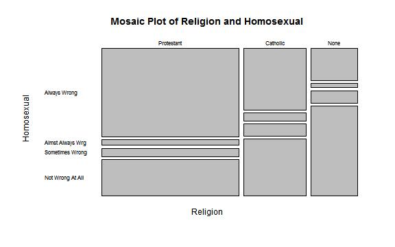
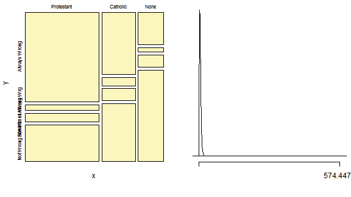

### Religion and Acceptance of Sexual Relations of the Same Sex

### Introduction:

Does religious preference have a significant relationship with how someone accepts sexual relations of the same sex?

This is very interesting to me as I am, too, a homosexual. I would like to understand how someone's outlook can depend on his/her religion. This is also a current topic often discussed, particularly in the United States, as some of the states have started recognizing same sex marriages.

For the sake of reading this study in a web-friendly format, you may go to https://github.com/foxyreign/GSSProject/blob/master/Homosexual%20and%20Religion.md.

### Data:

A pre-processed data set has been provided in the course and this can be downloaded at http://bit.ly/dasi_gss_data. 

>Smith, Tom W., Michael Hout, and Peter V. Marsden. General Social Survey, 1972-2012 [Cumulative File]. ICPSR34802-v1. Storrs, CT: Roper Center for Public Opinion Research, University of Connecticut /Ann Arbor, MI: Inter-university Consortium for Political and Social Research [distributors], 2013-09-11. from http://doi:10.3886/ICPSR34802.v1. Persistent URL: *http://doi.org/10.3886/ICPSR34802.v1*

The data was collected by interviewing a random sample of all noninstitutionalized, English and Spanish speaking persons 18 years of age or older, living in the United States. These interviews were conducted on the first six months of each year. It is also noted that Spanish-speakers were added in 2006. The surveys were done on computer-assisted personal interviews (CAPI), face-to-face interviews and telephone interviews from 1972-2012.

During data munging, certain cases and variables were dropped to customize the study; below are the following syntaxes to prepare the data.


```r
# Load GSS dataset and Inference
load(url("http://bit.ly/dasi_gss_data"))
source("http://bit.ly/dasi_inference")

# Subset only selected religions
gss <- subset(gss, relig == "Protestant" | relig == "Catholic" | relig == "None")

# And omit NA cases in homosexual variable
gss <- subset(gss, !is.na(gss$homosex))

# Include interviews done on 2006 and later
gss <- subset(gss, year > 2005)

# Factor only the selected religion and responses
religion <- factor(gss$relig)
homosexual <- factor(gss$homosex)

# Produce a dataset from the subsets
gss <- data.frame(religion, homosexual)
```


Originally, there were 57,061 cases that fall under the criteria of selected religion: Protestant, Catholic and None. 32,789 of these cases are valid while 24,272 contain NA or missing values; 57.46% and 42.54% respectively. With further subsetting excluding the invalid cases, only interviews conducted in 2006 and later were included in this study to eliminate bias. Each case in the dataset is the interview of an individual.

Two categorical variables were used in the observational study - **homosexual**, the sexual relationship of the same sex and **religion**, the preference of religion. Four levels of answers were available to respondents that describe their acceptance - Always Wrong, Almost Always Wrong, Sometimes Wrong and Not Wrong At All. Three major religions were included in the study - Protestants, Catholics and None.

Since the surveys were conducted with no random assignment and no control groups of subjects as these were just used to gather trends and patterns in certain attitudes, behaviors in American population, this cannot infer causality.

As this is an observational study, this can infer generalizability of the American population 18 years and above. 

### Exploratory data analysis:
*An error is shown below because during knitting, R markdown cannot install a package on the default library, this is just normal. Please take note to install the gmodels package.*

```r
install.packages("gmodels")
```

```
## Error: trying to use CRAN without setting a mirror
```

```r
library(gmodels)
```


```r
mosaicplot(table(gss$religion, gss$homosexual), las = 1, main = "Mosaic Plot of Religion and Homosexual", 
    xlab = "Religion", ylab = "Homosexual")
```



```r
CrossTable(x = gss$homosexual, y = gss$religion, chisq = T, prop.r = T, prop.c = T, 
    prop.t = T, expected = T, digits = 2, dnn = c("Homosexual (Response)", "Religion (Explanatory)"))
```

```
## 
##  
##    Cell Contents
## |-------------------------|
## |                       N |
## |              Expected N |
## | Chi-square contribution |
## |           N / Row Total |
## |           N / Col Total |
## |         N / Table Total |
## |-------------------------|
## 
##  
## Total Observations in Table:  5130 
## 
##  
##                       | Religion (Explanatory) 
## Homosexual (Response) | Protestant |   Catholic |       None |  Row Total | 
## ----------------------|------------|------------|------------|------------|
##          Always Wrong |       1830 |        576 |        225 |       2631 | 
##                       |    1468.85 |     663.65 |     498.51 |            | 
##                       |      88.80 |      11.58 |     150.06 |            | 
##                       |       0.70 |       0.22 |       0.09 |       0.51 | 
##                       |       0.64 |       0.45 |       0.23 |            | 
##                       |       0.36 |       0.11 |       0.04 |            | 
## ----------------------|------------|------------|------------|------------|
##      Almst Always Wrg |        113 |         75 |         30 |        218 | 
##                       |     121.71 |      54.99 |      41.31 |            | 
##                       |       0.62 |       7.28 |       3.09 |            | 
##                       |       0.52 |       0.34 |       0.14 |       0.04 | 
##                       |       0.04 |       0.06 |       0.03 |            | 
##                       |       0.02 |       0.01 |       0.01 |            | 
## ----------------------|------------|------------|------------|------------|
##       Sometimes Wrong |        174 |        111 |         86 |        371 | 
##                       |     207.12 |      93.58 |      70.29 |            | 
##                       |       5.30 |       3.24 |       3.51 |            | 
##                       |       0.47 |       0.30 |       0.23 |       0.07 | 
##                       |       0.06 |       0.09 |       0.09 |            | 
##                       |       0.03 |       0.02 |       0.02 |            | 
## ----------------------|------------|------------|------------|------------|
##      Not Wrong At All |        747 |        532 |        631 |       1910 | 
##                       |    1066.32 |     481.78 |     361.89 |            | 
##                       |      95.63 |       5.23 |     200.11 |            | 
##                       |       0.39 |       0.28 |       0.33 |       0.37 | 
##                       |       0.26 |       0.41 |       0.65 |            | 
##                       |       0.15 |       0.10 |       0.12 |            | 
## ----------------------|------------|------------|------------|------------|
##          Column Total |       2864 |       1294 |        972 |       5130 | 
##                       |       0.56 |       0.25 |       0.19 |            | 
## ----------------------|------------|------------|------------|------------|
## 
##  
## Statistics for All Table Factors
## 
## 
## Pearson's Chi-squared test 
## ------------------------------------------------------------
## Chi^2 =  574.4     d.f. =  6     p =  7.564e-121 
## 
## 
## 
```


The dataset consists of two categorical variables, hence computing for the mean or median is not applicable. The results in the chi-squared test are further discussed in the inference section.

A majority of the residents of the US are Protestants, followed by Catholics and lastly, by Atheists or those with no religion. Of the respondents, 56% are Protestants, 25% are Catholics and 19% have no religion. 

By survey responses of acceptance of same sexual relations, 51% answered Always Wrong, 4% said Almost Always Wrong, 7% said Sometimes Wrong and 37% answered Not Wrong At All. 

After customization of data, the total number of interviews is 5,130.

### Inference:

Does religious preference have significant relationship with how they accept sexual relations of the same sex? The null hypothesis states that the religion (explanatory) have no difference with how they accept sexual relations of the same sex (response).

* Null Hypothesis - H<sub>0</sub> - Homosexual and Religion are independent; there is no difference in religion and acceptance of sexual relations of same sex.
* Alternative Hypothesis - H<sub>A</sub> - Homosexual and Religion are dependent; there is difference in religion and acceptance of sexual relations of same sex.

It was already mentioned that random sampling was made when the surveys were conducted and the cases are independent of each other. Each population is at least 10 times as large as its respective sample. Also, in the contingency table above, the expected frequency count for each cell of the table is at least 5.

Since there are more than two levels for each categorical variables, Chi-squared test of independence was used to perform the inference.

Using the inference large function provided in the course, the results were the same. I just thought of using the frequency table above since that the labels in the mosaic plot included in the inference function cannot be rotated.


```r
inference(y = gss$homosexual, x = gss$religion, est = "proportion", type = "ht", 
    method = "theoretical", alternative = "greater", siglevel = 0.99)
```

```
## Warning: package 'BHH2' was built under R version 3.0.3
```

```
## Response variable: categorical, Explanatory variable: categorical
## Chi-square test of independence
## 
## Summary statistics:
##                   x
## y                  Protestant Catholic None  Sum
##   Always Wrong           1830      576  225 2631
##   Almst Always Wrg        113       75   30  218
##   Sometimes Wrong         174      111   86  371
##   Not Wrong At All        747      532  631 1910
##   Sum                    2864     1294  972 5130
```

```
## H_0: Response and explanatory variable are independent.
## H_A: Response and explanatory variable are dependent.
## Check conditions: expected counts
##                   x
## y                  Protestant Catholic   None
##   Always Wrong         1468.8   663.65 498.51
##   Almst Always Wrg      121.7    54.99  41.31
##   Sometimes Wrong       207.1    93.58  70.29
##   Not Wrong At All     1066.3   481.78 361.89
## 
## 	Pearson's Chi-squared test
## 
## data:  y_table
## X-squared = 574.4, df = 6, p-value < 2.2e-16
```




The parameter to estimate is proportion performed using a hypothesis test with a significance level of 0.99. Inference is done using the theoretical method based on central limit theorem. The direction of hypothesis is to greater for chi^2 test since the outcome will always be positive. Confidence interval nor ANOVA are not applicable in this criteria because the two variables being associated both have more than 2 levels.

The p-value of less than 0.01, which is the set alpha, is the probability that the test outcome would take a value as extreme or more extreme than that observed. The test showed a chi-squared value of 574.4475 with 6 degrees of freedom where the p-value is extremely less than 0.01.

Looking at the curve of the chi-squared distribution with the same degrees of freedom, 574 is way far on the right. With such a very low probability value, there is a very strong evidence against the null hypothesis, proven that the two variables are dependent of each other; therefore, it is rejected. 

### Conclusion:

There may be other confounding factors that affected the outcome as this study is just restricted to the relationship between two variables only. The respondents who have no religion tend to be more open with sexual relations of the same sex compared to Protestants. The Catholics are almost divided equally in the extremes where it is always wrong and not wrong at all of acknowledging sexual relations of the same sex.

A different study may be conducted comparing two religions and picking just one response from the homosexual variable as to test goodness of fit using chi-square test, as well. Another approach is to conduct comparison among religions that were not included in the initial study.

Based on the tests conducted using the chi-squared test of independence, I conclude that within the population of people living in the United States, the acceptance of sexual relations by people of the same sex vary by religion.
